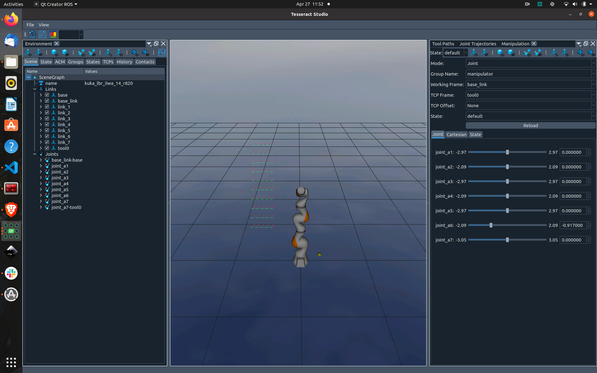

# tesseract_qt
Tesseract Qt Widgets and Applications

Platform             | CI Status
---------------------|:---------
Linux (Focal)        | 
Linux (Unstable)     | 
Lint  (Clang-Format) | 
Lint  (CMake-Format) | 

## Application Screenshots

Below are screenshots to highlight some of the applications within this repository and does not incude everything.

### Tesseract Studio

## Widget Screenshots

Below are screenshots to highlight some of the widgets within this repository and does not incude everything.

### Scene Graph Widget

### Scene State Widget

### Allowed Collision Matrix Widget

### Kinematic Groups Widget

### Command History Widget

### Contact Results Widget

### Joint Trajectory Widget

### Manipulation Widget

## Themes
- Editor: https://github.com/HappySeaFox/qsseditor
- https://github.com/ColinDuquesnoy/QDarkStyleSheet
- https://qss-stock.devsecstudio.com/templates.php

## Material Design Icons
repo: https://github.com/google/material-design-icons
search: https://fonts.google.com/icons

## Icons Provided by Freepik

Icons made by <a href="https://www.freepik.com" title="Freepik">Freepik</a> from <a href="https://www.flaticon.com/" title="Flaticon">www.flaticon.com</a>

  - trajectory.png
  - programming.png
  - chart.png
  - dynamics.png
  - color.png
  - orientation.png
  - limits.png
  - mesh.png
  - shapes.png
  - cone.png
  - cylinder.png
  - anchor.png
  - revolute.png
  - warning.png
  - url.png
  - rgb.png
  - numeric.png
  - plane.png
  - save.png
  - restore.png
  - layout.png

Icons made by <a href="https://www.flaticon.com/free-icons/log" title="log icons">Log icons created by Smartline - Flaticon</a>

- log.png

Icons made by <a href="https://www.flaticon.com/free-icons/selection-tool" title="selection tool icons">Selection tool icons created by berkahicon - Flaticon</a>

- select-box.png

Icons made by <a href="https://www.flaticon.com/free-icons/view" title="view icons">View icons created by th studio - Flaticon</a>

- show.png
- hide.png

Icons made by <a href="https://www.flaticon.com/authors/those-icons" title="Those Icons"> Those Icons </a> from <a href="https://www.flaticon.com/" title="Flaticon">www.flaticon.com'</a>

- plugin.png

Icons made by <a href="https://www.flaticon.com/authors/flat-icons" title="Flat Icons">Flat Icons</a> from <a href="https://www.flaticon.com/" title="Flaticon">www.flaticon.com</a>

- robotic-arm.png

Icons made by <a href="https://www.flaticon.com/authors/ferdinand" title="Ferdinand"> Ferdinand </a> from <a href="https://www.flaticon.com/" title="Flaticon">www.flaticon.com'</a>

- merge.png

Icons made by <a href="https://www.flaticon.com/authors/skyclick" title="Skyclick">Skyclick</a> from <a href="https://www.flaticon.com/" title="Flaticon">www.flaticon.com</a>

- safety.png

Icons made by <a href="https://www.flaticon.com/authors/karacis" title="Karacis">Karacis</a> from <a href="https://www.flaticon.com/" title="Flaticon">www.flaticon.com</a>

- calibration.png

Icons made by <a href="https://www.flaticon.com/authors/becris" title="Becris">Becris</a> from <a href="https://www.flaticon.com/" title="Flaticon">www.flaticon.com</a>

- graph.png

Icons made by <a href="https://www.flaticon.com/authors/smashicons" title="Smashicons">Smashicons</a> from <a href="https://www.flaticon.com/" title="Flaticon">www.flaticon.com</a>

- origin.png

Icons made by <a href="https://www.flaticon.com/authors/creatype" title="Creatype">Creatype</a> from <a href="https://www.flaticon.com/" title="Flaticon">www.flaticon.com</a>

- axis.png

Icons made by <a href="https://www.flaticon.com/authors/good-ware" title="Good Ware">Good Ware</a> from <a href="https://www.flaticon.com/" title="Flaticon">www.flaticon.com</a>

- sphere.png

Icons made by <a href="https://www.flaticon.com/authors/andrean-prabowo" title="Andrean Prabowo">Andrean Prabowo</a> from <a href="https://www.flaticon.com/" title="Flaticon">www.flaticon.com</a>

- continuous.png

Icons made by <a href="https://www.flaticon.com/authors/good-ware" title="Good Ware">Good Ware</a> from <a href="https://www.flaticon.com/" title="Flaticon">www.flaticon.com</a>

- octree.png

 Icons made by <a href="" title="kmg design"> kmg design </a> from <a href="https://www.flaticon.com/" title="Flaticon">www.flaticon.com'</a>

- cube.png

 Icons made by <a href="https://www.flaticon.com/authors/bartama-graphic" title="Bartama Graphic"> Bartama Graphic </a> from <a href="https://www.flaticon.com/" title="Flaticon">www.flaticon.com'</a>

- capsule.png

 Icons made by <a href="https://www.flaticon.com/authors/trinh-ho" title="Trinh Ho"> Trinh Ho </a> from <a href="https://www.flaticon.com/" title="Flaticon">www.flaticon.com'</a>

- surface.png

Icon made from <a href="http://www.onlinewebfonts.com/icon">Icon Fonts</a> is licensed by CC BY 3.0

- zoom_in.svg
- zoom_out.svg
- data.svg
- true-false.svg
- key-value.svg
- array.svg

